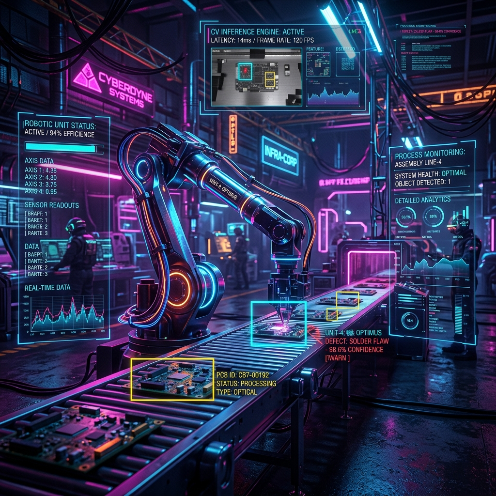

# 👹 Kiosk Goblin

Kiosk Goblin is a lightweight, portrait-mode (1080x1920) kiosk visualizer framework powered by Python, Streamlit, and Plotly. 

Designed for mini-PCs (e.g., Intel NUC, Raspberry Pi) and vertical monitors, it allows machine learning developers, engineers, and makers to showcase real-time telemetry, model training logs, datasets, system load, and media streams in a premium, glassmorphism dark-themed dashboard.



---

## Key Features

1. **Kiosk-Optimized Layout**: Tailored for vertical 1080x1920 aspect ratios with minimized margins, hidden headers/footers, and clean font hierarchies.
2. **YAML-Configurable Layout**: Compose rows and adjust column widths on the fly using a simple config file (`examples/dashboard.yaml`).
3. **Plugin-Driven Architecture**: Easily drop new Python visualizers into the `kiosk_goblin/plugins/` directory to expand visual capabilities.
4. **Stateful Telemetry Simulation**: Built-in stateful mock generators for ML training loss graphs, class donuts, CPU/GPU loads, object-detection camera feeds, and terminal event logs.
5. **Autorefresh Integration**: Zero-user-interaction periodic screen reloads (defaulting to every 10 seconds).

---

## Project Structure

```
kiosk-goblin/
  app.py                     # App Entrypoint
  kiosk_goblin/
    core/
      config.py              # YAML Configuration parser
      layout.py              # Dynamic grid builder
      plugin.py              # Plugin registry/loader
      refresh.py             # Page autorefresh timer
    datasources/
      mock_source.py         # Stateful mock dataset simulation
      json_source.py         # Offline mockup files dataset
    plugins/
      ml_training/           # Epoch curves & performance
      dataset_status/        # Class donuts & counts
      system_metrics/        # CPU/GPU/Temp resource metrics
      media_preview/         # Custom inference overlays
      event_log/             # Styled terminal/event console
    ui/
      cards.py               # Neon glassmorphism UI card components
      charts.py              # Plotly dark mode config helpers
      theme.py               # Kiosk custom CSS injector
  examples/
    dashboard.yaml           # Layout configuration
    *.json                   # Default fallback datasources
  assets/                    # Assets and media
  scripts/
    kiosk.sh                 # Linux Kiosk automated script
```

---

## Installation & Setup

### 1. Prerequisites
- Python 3.10 or 3.11
- Chrome or Chromium Browser (if using Linux kiosk launcher)

### 2. Local Installation
1. Clone this repository to your target system:
   ```bash
   git clone https://github.com/gunminy/kiosk-goblin.git
   cd kiosk-goblin
   ```
2. Create and activate a Python virtual environment:
   ```bash
   python3 -m venv venv
   source venv/bin/activate
   ```
3. Install required packages:
   ```bash
   pip install -r requirements.txt
   ```
4. Create your local environment settings:
   ```bash
   cp .env.example .env
   ```

---

## Running the Application

### 1. Standard Mode
To run the dashboard in standard server mode:
```bash
streamlit run app.py
```
This will start a local server and output a URL (usually `http://localhost:8501`) that you can open in any browser.

### 2. Linux Fullscreen Kiosk Mode
If you are deploying on a mini-PC connected to a vertical TV or screen, you can run the bootstrap shell script:
```bash
./scripts/kiosk.sh
```
This script will:
- Boot up Streamlit in background headless mode.
- Launch Chromium in fullscreen kiosk mode (`--kiosk`) targeted to your screen.
- Disable Chrome's annoying crash and restore prompts.

---

## Dashboard Configuration

### Layout Grid (`examples/dashboard.yaml`)
You can restructure the visual hierarchy by editing `examples/dashboard.yaml`. The grid width is based on a standard **12-column layout**:

```yaml
title: "👹 KOBLIN KIOSK v1.0.0"
refresh_interval: 10
theme: "cyberpunk-dark"

# Choose datasource: 'mock' (dynamic) or 'json' (offline file-based)
datasource:
  type: "mock"

layout:
  - row:
      - plugin: "ml_training"
        width: 12
  - row:
      - plugin: "dataset_status"
        width: 6
      - plugin: "system_metrics"
        width: 6
  - row:
      - plugin: "media_preview"
        width: 12
  - row:
      - plugin: "event_log"
        width: 12
```

---

## Creating Custom Plugins

To write a custom visualization plugin:
1. Create a subdirectory under `kiosk_goblin/plugins/<your_plugin_name>`.
2. Create an `__init__.py` file.
3. Inherit from `BasePlugin` and export your class as `PluginClass`:

```python
import streamlit as st
from kiosk_goblin.core.plugin import BasePlugin

class MyCustomPlugin(BasePlugin):
    @property
    def name(self) -> str:
        return "my_custom_plugin" # Must match config name

    @property
    def title(self) -> str:
        return "My Custom Visualizer"

    def render(self, data_source, panel_config: dict):
        st.write("Hello from My Custom Visualizer!")

PluginClass = MyCustomPlugin
```
4. Declare your plugin configuration inside `examples/dashboard.yaml`'s `layout` node.

---

## License

This project is licensed under the [MIT License](LICENSE).
